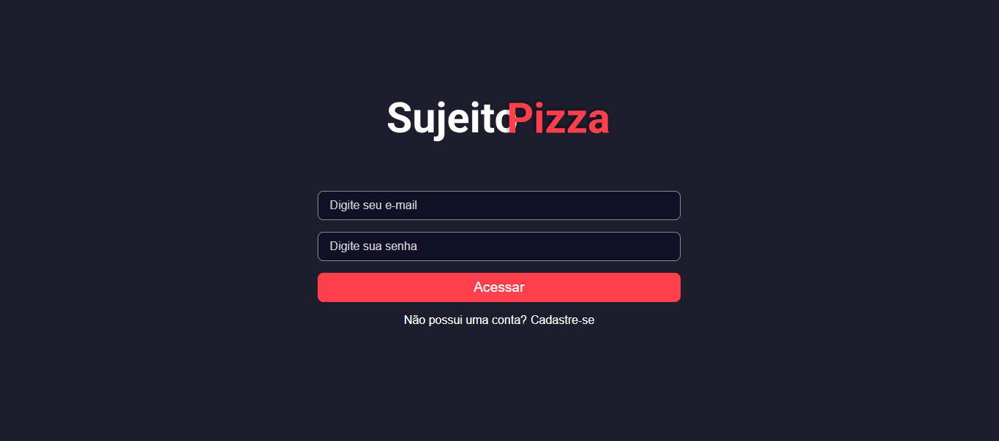
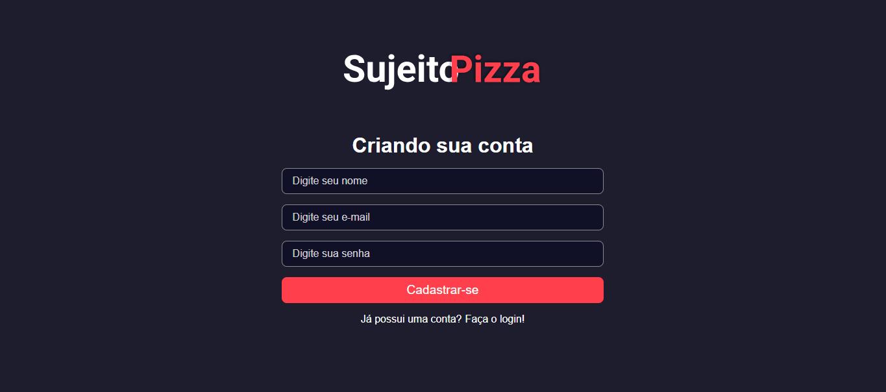
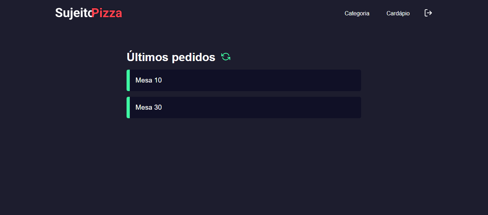
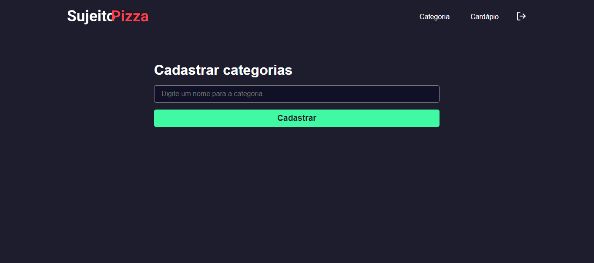
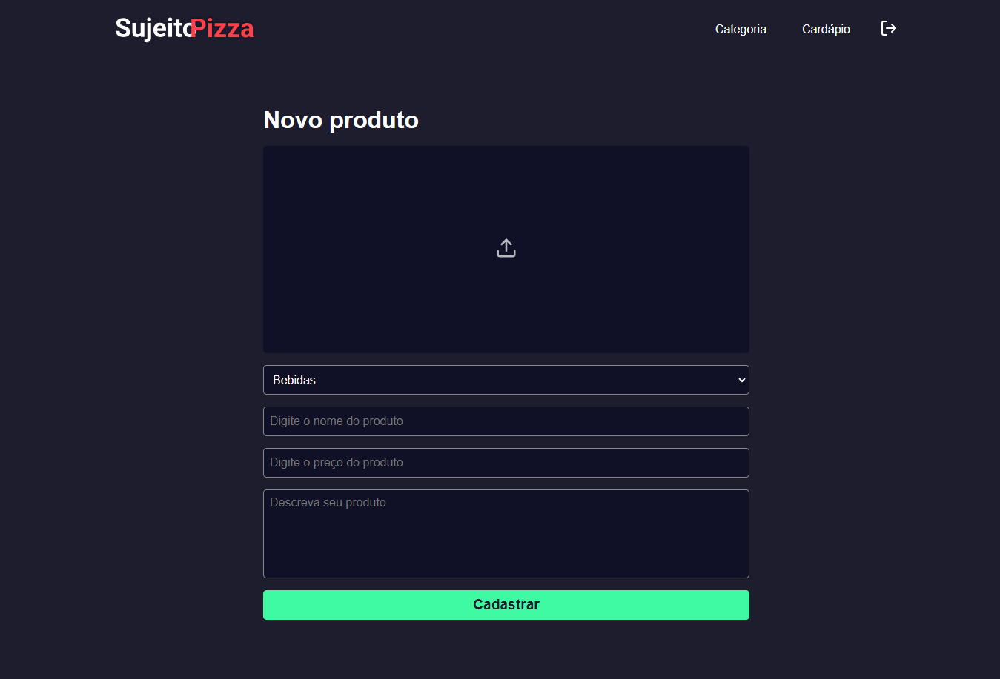
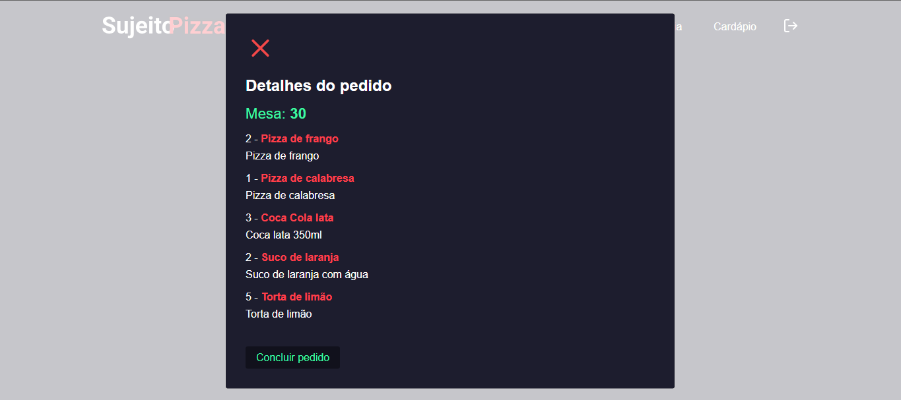

# Sujeito Pizzaria - Frontend

Bem-vindo ao repositório do frontend do Sistema de Gestão de Pedidos da Sujeito Pizzaria!

## Visão Geral

Este frontend é parte do sistema desenvolvido para a Sujeito Pizzaria, proporcionando uma interface de usuário intuitiva e eficiente para a gestão de pedidos. Com uma interface amigável, os funcionários da pizzaria podem receber, visualizar e finalizar os pedidos dos clientes de forma fácil e rápida.

## Tecnologias Utilizadas

- **React**: Utilizado como biblioteca principal para a construção da interface de usuário.
- **TypeScript**: Utilizado para adicionar tipagem estática ao JavaScript, garantindo um código mais robusto e menos propenso a erros.
- **Next.js**: Framework React utilizado para renderização do lado do servidor (SSR) e geração de páginas estáticas, garantindo uma aplicação mais rápida e SEO-friendly.

## Funcionalidades Principais

- **Login**: Permite que os funcionários façam login na plataforma para acessar as funcionalidades do sistema.
- **Cadastro de Usuário**: Possibilita o cadastro de novos usuários com diferentes níveis de permissões.
- **Visualização de Pedidos**: Exibe os pedidos em tempo real, permitindo que os funcionários acompanhem o status dos pedidos.
- **Cadastro de Categorias e Produtos**: Permite a adição de novas categorias e produtos ao cardápio da pizzaria.
- **Detalhes do Pedido**: Fornece informações detalhadas sobre cada pedido, incluindo itens, status e cliente.

## Capturas de Tela

### Login

### Cadastro de Usuário

### Últimos Pedidos

### Cadastrar Categorias

### Novo Produto

### Detalhes do Pedido

## Como Executar o Projeto Localmente

1. Certifique-se de ter o Node.js e o npm instalados em sua máquina.
2. Clone este repositório: `git clone https://github.com/felipergoncalves/Sujeito-Pizzaria-Frontend.git`
3. Navegue até o diretório do frontend: `cd sujeito-pizzaria-frontend`
4. Instale as dependências do projeto: `npm install`
5. Inicie o servidor de desenvolvimento: `npm run dev`
6. O frontend estará acessível em [http://localhost:3000](http://localhost:3000) no seu navegador.

## Contribuindo

Se deseja contribuir para este projeto, sinta-se à vontade para abrir uma issue ou enviar um pull request. Toda contribuição é bem-vinda!

## Autor

[Felipe Gonçalves](https://github.com/felipergoncalves)
